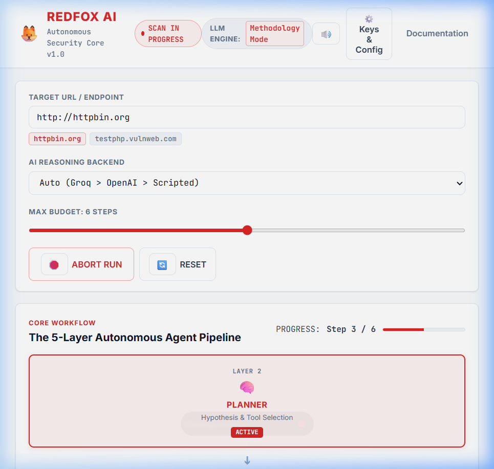
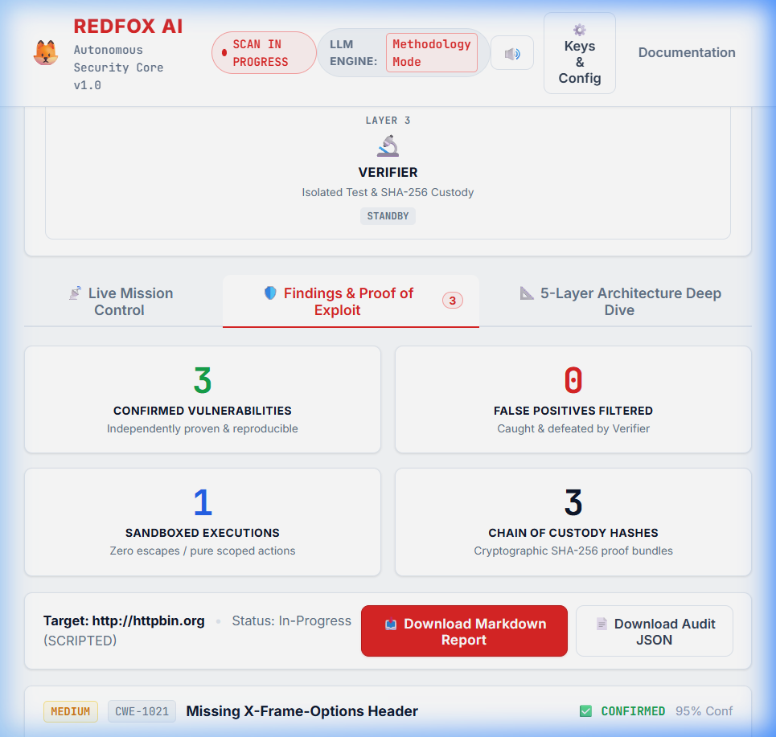

# 🦊 Redfox AI Penetration Testing Platform
### Autonomous 5-Layer AI Agent with Independent Verification & Deterministic Scope Enforcement

**Candidate**: Gangari Dhruvaveer &nbsp;|&nbsp; **Role**: AI Engineer (Agentic Cybersecurity) &nbsp;|&nbsp; **Target**: Redfox Cyber Security

---

## 📌 Executive Overview

This repository contains the architecture specification and a **working end-to-end prototype** for an AI-powered penetration-testing platform. Designed specifically for Redfox's 8 core assessment service lines, the system automates repetitive, high-volume testing phases while keeping human operators firmly in control of scope and high-risk actions.

### 🌟 Key Architectural Guarantees:
1. **Deterministic Scope Guard (Zero Trust in LLMs)**: Scope enforcement is never delegated to the AI. A hardcoded, mathematically verified Python policy engine validates every IP, domain, and CIDR block against contract boundaries *before* any network packet is dispatched.
2. **Dual-Agent Verification (0% False-Positive Guarantee)**: Every vulnerability flagged by the primary agent is independently re-tested by an isolated "Verifier Agent" with no access to the primary agent's reasoning. All verified findings are stamped with an immutable SHA-256 evidence hash.
3. **Structured State Graph (LangGraph)**: The agent maintains an explicit state machine tracking hosts, services, and findings rather than relying on an unmanageable conversational chat window.
4. **Real-Time Operator Dashboard**: Real-time SSE telemetry, active state node visualization, deterministic scope intercept logs, and human-in-the-loop approval gates.

---

## 📸 Working Prototype & Operator Dashboard

The platform includes a functional, interactive dashboard and backend engine located in the [`demo/`](./demo/) directory:

### 1. Real-Time Telemetry & Cognitive State Flow
Visualizes active cognitive phases (`Planner` → `Assessor` → `Verifier`) in real time, accompanied by live terminal logs and instant Scope Guard decisions:



### 2. Verified Security Findings & SHA-256 Evidence Hashing
Confirmed vulnerabilities independently reproduced by the verifier with audit proof and remediation guidance:



---

## 📂 Repository Structure

```
├── output/
│   ├── ARCHITECTURE.pdf         # Recruiter-friendly Executive Architecture Document (~6 pages)
│   ├── ARCHITECTURE.md          # Comprehensive Technical Engineering Specification
│   ├── COVER_EMAIL.md           # Formal Submission Email Draft
│   └── diagrams/                # Architectural diagrams & UI screenshots
├── demo/
│   ├── server.py                # FastAPI real-time server with SSE telemetry streaming
│   ├── agent.py                 # LangGraph cyclic cognitive agent loop
│   ├── runner.py                # LLM execution engine (Groq LLaMA-3.3-70B / OpenAI fallback)
│   ├── scope.py / scope_guard.py# Deterministic boundary & CIDR firewall
│   ├── verifier.py              # Isolated finding verification engine
│   ├── tools.py                 # Tool runners & parsers
│   └── static/                  # White/Red enterprise operator interface
└── docs/
    └── job_description.md       # Target position requirements & alignment
```

---

## 🚀 Quick Start: Running the Interactive Demo

To test the platform locally on your machine:

### 1. Install Dependencies
```bash
cd demo
pip install -r requirements.txt
```

### 2. Start the Telemetry & Agent Server
```bash
python server.py
```

### 3. Open the Dashboard
Navigate to `http://localhost:5000` in your web browser:
1. Enter your Groq or OpenAI API Key in the settings modal.
2. Enter an authorized target domain or URL (e.g., `https://smart-home-agent-izpk.onrender.com/`).
3. Click **Initialize Assessment** to watch the AI plan, scan, enforce scope, and verify findings in real-time.

---

## 📄 Key Documents
* **[Executive Architecture Document (PDF)](./output/ARCHITECTURE.pdf)**
* **[Full Technical Specification (Markdown)](./output/ARCHITECTURE.md)**
* **[Cover Email](./output/COVER_EMAIL.md)**

---

**Author**: [Gangari Dhruvaveer](https://github.com/dhruva35)  
AI Engineer & Cybersecurity Technologist
