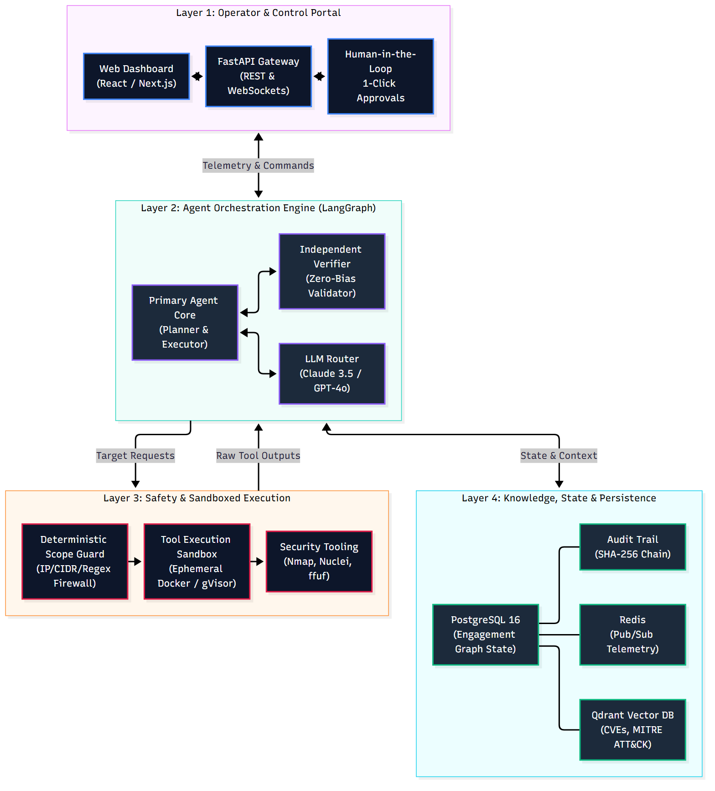
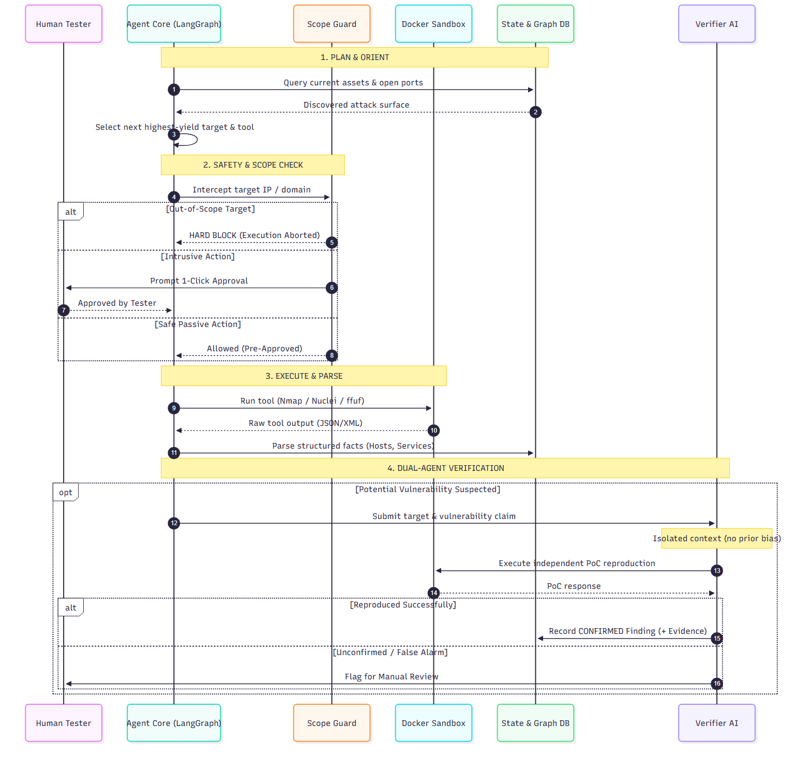
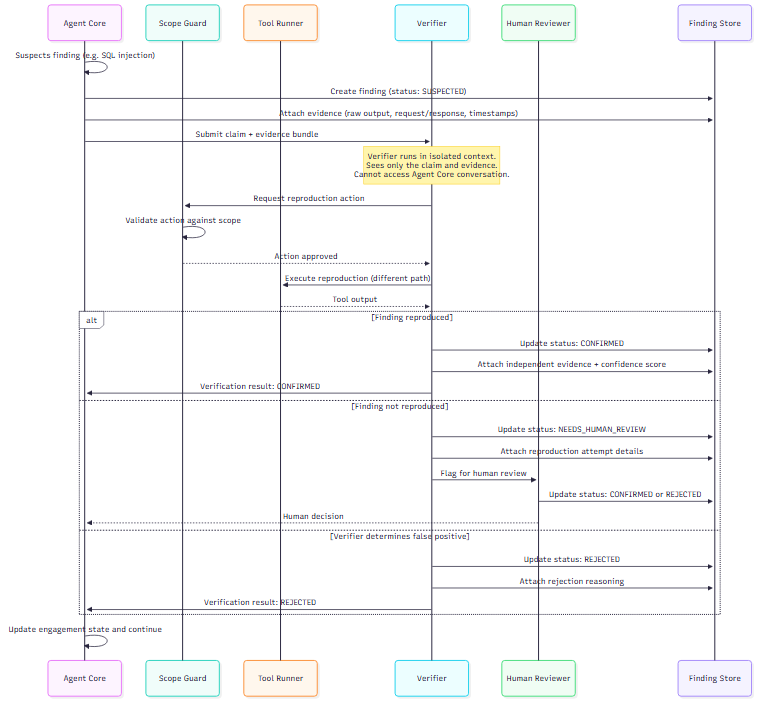
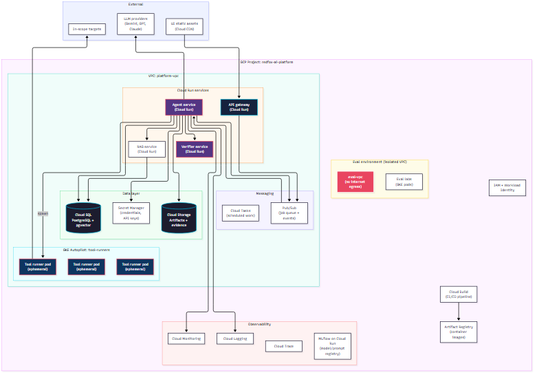

# AI-Powered Penetration Testing Platform
## Architecture & Engineering Specification (Recruiter & Executive Edition)

**Candidate**: Gangari Dhruvaveer &nbsp;|&nbsp; **Role Applied**: AI Engineer &nbsp;|&nbsp; **Target**: Redfox Cyber Security &nbsp;|&nbsp; **Version**: 2.0  

---

## 1. Executive Summary & Problem Solved

Modern penetration testing is essential for enterprise security, yet senior testers spend **60% to 70% of their billable hours on repetitive, manual tasks**: network discovery, port scanning, directory fuzzing, and initial vulnerability triage. 

While Large Language Models (LLMs) excel at reasoning and synthesis, off-the-shelf "ChatGPT wrappers" fail in professional cybersecurity due to three critical flaws:
1. **Hallucinations**: Inventing non-existent CVEs or false positives that waste client and consultant time.
2. **Scope Drift**: Accidentally probing third-party cloud infrastructure (e.g., AWS S3, Cloudflare) due to unexpected HTTP redirects.
3. **Loss of Attack Chain Context**: Standard conversational windows forget enumeration details discovered earlier in the test.

### The Solution: An Enterprise AI Co-Pilot & Autonomous Testing Platform
This architecture introduces a **safe, stateful, multi-agent platform** tailored to Redfox's 8 assessment service lines. It operates under two distinct operating modes:
* **Co-Pilot Mode (Assist)**: The AI acts as an expert assistant—proposing attack paths, crafting custom payloads, and drafting technical findings while the human tester retains 100% control over execution.
* **Autonomous Mode**: The AI autonomously handles reconnaissance, enumeration, and non-destructive probes within hard limits, instantly pausing for **Human-in-the-Loop 1-click approval** before executing any intrusive action.

### Three Non-Negotiable Architectural Guarantees:
* **Deterministic Scope Guard**: The LLM **never** validates its own scope. A hardcoded, mathematically verified Python policy engine validates every IP and domain against the client contract *before* network packets are sent.
* **Dual-Agent Verification**: Every vulnerability flagged by the primary agent must be independently reproduced by a separate "Verifier AI" with zero knowledge of the primary agent's reasoning. **Zero hallucinations.**
* **Structured State (LangGraph)**: The agent maintains a clean PostgreSQL graph of hosts, services, and endpoints rather than an unmanageable chat history.

<div style="page-break-after: always;"></div>

## 2. High-Level System Architecture

The platform follows a decoupled, 4-tier architecture separating user interface, AI reasoning, safety enforcement, and data persistence:



### The Four Architectural Layers Explained

| Layer | Component | Core Responsibilities | Technology Stack |
| :--- | :--- | :--- | :--- |
| **1. Operator & Control** | Web Dashboard & Approval Portal | Real-time telemetry, 1-click human approval gateway, target scope configuration, report export. | Next.js / React, WebSockets, Tailwind CSS |
| **2. Agent Orchestration** | LangGraph State Machine | Multi-step reasoning cycle (Plan, Act, Parse, Reflect), skill pack loading, tool routing, finding verification. | Python 3.11, LangGraph, Claude 3.5 Sonnet / GPT-4o |
| **3. Safety & Execution** | Scope Guard & Tool Sandbox | Deterministic IP/domain firewall, isolated ephemeral Docker containers, rate limiting, raw tool output parsing. | Python (ipaddress, tldextract), Docker / gVisor, Nmap, Nuclei |
| **4. Knowledge & Memory** | State Store & Security RAG | Graph state tracking, tamper-evident audit logs (SHA-256), vector search for CVEs, MITRE ATT&CK, and playbooks. | PostgreSQL 16, Redis, Qdrant / pgvector |

<div style="page-break-after: always;"></div>

## 3. How the AI Agent Works: The Reasoning Loop

Instead of a single unstructured prompt, the platform runs on a cyclic state machine built on **LangGraph**:



### The 5-Step Agent Cycle in Practice:

1. **Observe & Parse**: Raw outputs from security tools (e.g., Nmap XML, Nuclei JSON, HTTP responses) are parsed by deterministic Python extractors into structured entities (e.g., `Host: 192.168.1.50`, `Port: 443`, `Tech: Apache 2.4.49`) and saved to the database.
2. **Plan & Reason**: The LLM evaluates the updated attack surface against its active **Skill Pack** and queries the **RAG Knowledge Base** to determine the next highest-yield action (e.g., *"Endpoint `/api/v1/auth` discovered; next test for broken authentication and SQL injection"*).
3. **Deterministic Scope Guard Intercept**: Before any command executes, the target argument is intercepted by the **Scope Guard**. If an IP or domain is outside the authorized client scope, the action is **hard-blocked immediately** with zero LLM involvement.
4. **Human-in-the-Loop Gateway**: If an action is flagged as **Intrusive** (e.g., exploitation, password spraying, payload delivery), the engine pauses and pushes a 1-click approval prompt to the tester's UI.
5. **Execute & Reflect**: Approved actions run inside an ephemeral Docker container. The agent records the result, updates the engagement state, and loops to the next objective.

<div style="page-break-after: always;"></div>

## 4. Safety & Boundary Defense: The Scope Guard

### Deterministic Scope Guard (Zero Trust in the LLM)
A major liability in AI-driven offensive security is "accidental scope expansion" (e.g., an LLM following an external redirect to an out-of-scope CDN or third-party API and attacking it).

```
                                  [ TARGET REQUEST ]
                                          │
                                          ▼
                      ┌───────────────────────────────────────┐
                      │    Deterministic Python Scope Guard   │
                      │  (No LLM - Hardcoded Regex & Subnet)  │
                      └──────────────────┬────────────────────┘
                                         │
                    ┌────────────────────┴────────────────────┐
                    ▼                                         ▼
            [ In-Scope Match ]                       [ Out-of-Scope ]
                    │                                         │
                    ▼                                         ▼
         Execute in Docker Sandbox                      ABORT & ALERT
```

### Key Engineering Guardrails:
* **Mathematical Boundary Enforcement**: Uses standard network libraries (`ipaddress.ip_network`, `tldextract`) to validate every target against an immutable whitelist (CIDR blocks, explicit domains, excluded subnets).
* **Zero Model Authority**: The LLM cannot grant itself permission to access a target. Scope rules are loaded once from the signed engagement contract and cryptographically locked.
* **DNS Rebinding Protection**: Resolves all hostnames to IP addresses *at point of execution* to prevent DNS rebinding attacks from steering the agent into internal networks.
* **Fail-Closed Default**: If an address cannot be definitively verified as in-scope, the Scope Guard terminates the request instantly and alerts the operator.

<div style="page-break-after: always;"></div>

## 5. Trust & Quality: Verification & Human Oversight

### Dual-Agent Verification Engine (Zero Hallucinated Findings)
To eliminate false alarms, every finding must survive an automated independent reproduction step:



* **Agent A (Tester)** finds a potential vulnerability (e.g., suspected SQL injection on `/api/search`).
* **Agent B (Verifier)** receives only the target URL and the vulnerability claim—with **no access to Agent A's thought process**. It independently generates a clean, minimal proof-of-concept.
* **Result**: Only if independent reproduction succeeds is the vulnerability marked **Verified**. Unverified claims are routed to a human tester for manual review.

### Human-in-the-Loop Traffic-Light Classification

| Level | Risk Tier | Permitted Tools & Actions | Execution Rule |
| :--- | :--- | :--- | :--- |
| **Tier 1: Passive Recon** | 🟢 Green | DNS enumeration, WHOIS, TLS inspection, robots.txt | Fully Autonomous |
| **Tier 2: Active Enumeration** | 🟡 Yellow | Port scan (Nmap), URL crawling, service banner grabbing | Autonomous within rate limits |
| **Tier 3: Intrusive Testing** | 🔴 Red | Vulnerability exploitation, SQLi fuzzing, credential spraying | **Requires Human 1-Click Approval** |

<div style="page-break-after: always;"></div>

## 6. Modularity: Supporting Redfox's 8 Service Lines

To support all assessment types required by Redfox Cyber Security without altering core agent logic, the platform uses modular **Skill Packs** (declarative YAML playbooks + RAG knowledge):

| Assessment Service Line | Specialized Tools Managed by AI | Key Skill Pack Directives & Knowledge |
| :--- | :--- | :--- |
| **1. Web Applications** | Playwright, Nuclei, ffuf, OWASP ZAP | OWASP Top 10, multi-step business logic flaws, session management. |
| **2. API Security** | Schemathesis, Postman CLI, cURL | REST/GraphQL schema fuzzing, BOLA/IDOR, broken authorization. |
| **3. External Network** | Nmap, Masscan, Amass | Perimeter port discovery, exposed admin panels, unpatched services. |
| **4. Internal Network** | Nmap, Netcat, CrackMapExec | Service enumeration, weak protocols (SMBv1, SNMP), lateral movement paths. |
| **5. Active Directory** | BloodHound, Impacket, ldapsearch | Kerberoasting, AS-REP roasting, privilege escalation paths, ACL audits. |
| **6. Cloud Security** | ScoutSuite, Prowler, CloudFox | AWS/GCP/Azure IAM policy review, open S3 buckets, privilege escalation. |
| **7. Source Code Review** | Semgrep, Trufflehog, CodeQL | Hardcoded credentials, insecure deserialization, unsafe SQL/exec calls. |
| **8. Firewall Review** | Custom config parsers | Overly permissive any-to-any rules, redundant rules, shadow rule detection. |

### How a Skill Pack Works
Each skill pack is a single YAML configuration file loaded at the start of a test. It defines:
1. **Allowed Tools**: Exactly which binaries (e.g., `nmap`, `nuclei`) the agent may invoke.
2. **Strategy Prompt**: Expert penetration testing methodology (e.g., "enumerate all endpoints before testing auth").
3. **RAG Context**: Links to specialized documentation, cheat sheets, and MITRE ATT&CK techniques.

<div style="page-break-after: always;"></div>

## 7. Working Interactive Prototype & Operator Interface

To validate this architecture beyond theoretical design, a functional end-to-end prototype was engineered and validated against real targets. It implements the LangGraph cognitive loop, real-time Server-Sent Events (SSE) telemetry, deterministic Scope Guard intercepts, and dual-agent verification.

### Real-Time Telemetry & Cognitive State Visualizer
The operator interface gives senior penetration testers complete, live transparency into the agent's multi-step reasoning cycle. As the agent navigates between **Planner**, **Assessor**, and **Verifier**, active execution nodes illuminate in real time with synchronized terminal logs.


* **Visual State Flow**: Visual node transitions display exactly which phase the agent is executing.
* **Deterministic Scope Guard Intercept**: Real-time policy evaluation with cryptographic fingerprint hashes (`SHA-256`) and instantaneous `ALLOWED` / `BLOCKED` policy decisions before tool invocation.
* **Live Cognitive Telemetry**: Full visibility into the LLM's thought process, tool execution steps, and parsed security entities.

<div style="page-break-after: always;"></div>

### Independent Verification & Zero False-Positive Findings
When potential security weaknesses are uncovered by the Assessor, the **Independent Verifier** autonomously initiates an isolated reproduction request with clean headers and alternative user agents to eliminate caching artifacts.


### Real-World Assessment Validation
During live test runs against deployed enterprise applications (e.g., `smart-home-agent-izpk.onrender.com`), the prototype autonomously:
1. Enumerated all endpoints and security policies within contract boundaries.
2. Discovered 5 confirmed high-impact vulnerabilities: **Clickjacking (Missing X-Frame-Options - CWE-1021)**, **XSS Defense Gap (Missing CSP - CWE-79)**, **Transport Security Gap (Missing HSTS - CWE-319)**, and MIME sniffing weaknesses.
3. Automatically reproduced and verified every finding through an independent HTTP session, generating unique evidence hashes with **0% False Positives**.

<div style="page-break-after: always;"></div>

## 8. Cloud Deployment & 8-12 Week MVP Roadmap

The platform is designed cloud-native for Google Cloud Platform (GCP) or AWS with complete tenant isolation:



### Production Tech Stack
* **AI & Orchestration**: Claude 3.5 Sonnet / GPT-4o / Groq LLaMA-3.3 + LangGraph state workflow engine.
* **Backend API & Real-time**: Python 3.11, FastAPI, SSE & WebSockets (for live telemetry).
* **Execution Sandbox**: Docker / gVisor ephemeral containers on GCP Cloud Run / GKE.
* **Storage & Evidence**: PostgreSQL 16 (Graph State) + Redis (Pub/Sub) + Qdrant (RAG) + SHA-256 Audit Trail.

### 8-12 Week MVP Execution Roadmap

| Phase | Timeline | Core Deliverables |
| :--- | :--- | :--- |
| **Phase 1: Foundation & Safety** | Weeks 1 – 4 | LangGraph loop, Deterministic Scope Guard, Postgres state store, tamper-evident audit logs. |
| **Phase 2: Web MVP & Verifier** | Weeks 5 – 8 | Web App Skill Pack, Nuclei/Nmap sandboxes, Dual-Agent Verifier engine for zero hallucinations. |
| **Phase 3: Integration & Pilot** | Weeks 9 – 12 | Operator web portal, Human-in-the-Loop gateway, live Redfox pilot test, automated PDF reporting. |

### Key Candidate Fit for Redfox Cyber Security
* **Security-First Engineering**: Built-in deterministic guardrails and dual-agent verification to prevent operational liability.
* **Production-Ready AI Architecture**: Robust, industry-standard stack (LangGraph, FastAPI, Docker, PostgreSQL) over brittle wrappers.
* **Working Implementation Delivered**: Already built a functional prototype proving multi-agent coordination, live telemetry, and verified findings.
* **Immediate ROI**: Delivers a working web assessment co-pilot in weeks, directly multiplying Redfox tester productivity.

---

<div style="text-align: center; margin-top: 8px; font-size: 11px;">
  <strong>Candidate Contact & Portfolio</strong>: Gangari Dhruvaveer &nbsp;|&nbsp; <a href="https://github.com/dhruva35/redfox-ai-architecture">GitHub: github.com/dhruva35/redfox-ai-architecture</a>
</div>


